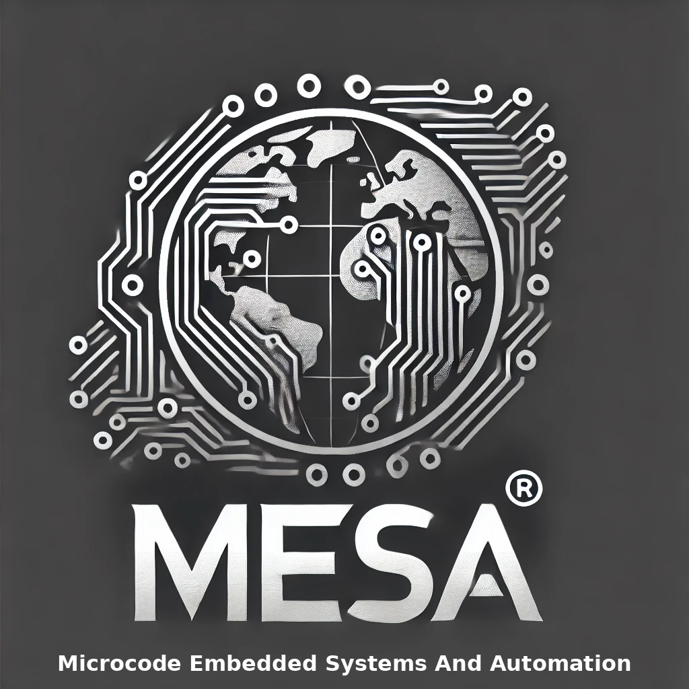

# Cortex Link A8R-M ESP32 Smart Relay Board

<p align="center">

</p>
## Overview

The Cortex Link A8R-M ESP32 Smart Relay Board is a versatile IoT development platform designed for seamless integration into smart home automation systems, industrial control applications, and IoT projects.

## Board Layout

<p align="center">

</p>

[](https://opensource.org/licenses/MIT)
[](https://www.espressif.com/en/products/socs/esp32)
[](https://github.com/mesa-automation/cortex-link-a8r-m/releases)
[](https://github.com/mesa-automation/cortex-link-a8r-m/wiki)

## Overview

The Cortex Link A8R-M ESP32 Smart Relay Board is a versatile IoT development platform designed for seamless integration into smart home automation systems, industrial control applications, and IoT projects. Powered by the ESP32 dual-core processor, this development board offers extensive connectivity options and flexible I/O configurations, making it an ideal solution for controlling devices, collecting data, and developing custom automation solutions.

## Features

- **Powerful Microcontroller**: ESP32 dual-core processor, 240 MHz, 8 MB flash, 520 KB SRAM
- **Versatile Connectivity**:
  - Wi-Fi 802.11 b/g/n (2.4 GHz)
  - Ethernet RJ45 port
  - Bluetooth BLE 4.0 and Classic
  - RS485/Modbus RTU
  - Optional GSM module support (2G/4G)
- **Comprehensive I/O**:
  - 6 relay outputs (12/24V DC or 250VAC, 10A)
  - 8 optically isolated digital inputs
  - 4 analog inputs (2× 4-20mA, 2× 0-5V DC)
  - 2 analog outputs (0-10V)
- **Expansion Capabilities**:
  - GSM module sockets
  - RF 433MHz/315MHz transceiver interface
  - I2C expandable interface
  - DS3231 RTC module
- **Software Compatibility**:
  - Arduino IDE
  - ESPHome
  - Home Assistant
  - ESP-IDF
  - PlatformIO
  - MicroPython

## Hardware Specifications

| Category | Specification |
|----------|--------------|
| Microcontroller | ESP32 dual-core, 32-bit, 240 MHz |
| Memory | 8 MB Flash, 520 KB SRAM |
| Power Input | 9V-12V DC |
| Power Consumption | 1W (idle), 10W (under load) |
| Dimensions | 200mm × 110mm × 45mm |
| Operating Temp | -40°C to +85°C |
| Certifications | CE, RoHS |

## Board Layout

<p align="center">

</p>

## Getting Started

### Installation

1. **Power Connection**
   - Connect 9-24V DC power supply to the power terminals, respecting polarity

2. **Network Setup**
   - For Ethernet: Connect an Ethernet cable to the RJ45 port
   - For Wi-Fi: Configure via the programming interface

3. **Development Environment**
   - Install [Arduino IDE](https://www.arduino.cc/en/software)
   - Add ESP32 board support via Boards Manager
   - Install required libraries (see Dependencies section)

### Basic Usage Example

```cpp
#include <Wire.h>
#include <Adafruit_MCP23017.h>

Adafruit_MCP23017 relayMCP;
Adafruit_MCP23017 inputMCP;

void setup() {
  Serial.begin(115200);
  Wire.begin();
  
  // Initialize relay MCP23017
  relayMCP.begin(0x20);
  for (int i = 0; i < 6; i++) {
    relayMCP.pinMode(i, OUTPUT);
    relayMCP.digitalWrite(i, LOW);
  }
  
  // Initialize input MCP23017
  inputMCP.begin(0x21);
  for (int i = 0; i < 8; i++) {
    inputMCP.pinMode(i, INPUT);
    inputMCP.pullUp(i, HIGH);
  }
  
  Serial.println("Cortex Link A8R-M initialized");
}

void loop() {
  // Read digital inputs and control corresponding relays
  for (int i = 0; i < 6; i++) {
    int inputState = inputMCP.digitalRead(i);
    relayMCP.digitalWrite(i, inputState);
    Serial.print("Input ");
    Serial.print(i);
    Serial.print(": ");
    Serial.println(inputState ? "ON" : "OFF");
  }
  
  delay(1000);
}
```

## ESPHome Integration

```yaml
esphome:
  name: cortexlink
  platform: ESP32
  board: esp32dev

wifi:
  ssid: !secret wifi_ssid
  password: !secret wifi_password

# Enable Home Assistant API
api:
  encryption:
    key: !secret encryption_key

ota:
  password: !secret ota_password

i2c:
  sda: GPIO21
  scl: GPIO22
  scan: true

# MCP23017 for relay outputs
mcp23017:
  - id: 'relay_mcp'
    address: 0x20

# MCP23017 for digital inputs
mcp23017:
  - id: 'input_mcp'
    address: 0x21

# Define relay outputs
switch:
  - platform: gpio
    name: "Relay 1"
    pin:
      mcp23017: relay_mcp
      number: 0
      mode: OUTPUT
    id: relay_1
```

## Dependencies

- [Adafruit MCP23017 Arduino Library](https://github.com/adafruit/Adafruit-MCP23017-Arduino-Library)
- [ESP32 Arduino Core](https://github.com/espressif/arduino-esp32)
- For Modbus: [ModbusMaster Library](https://github.com/4-20ma/ModbusMaster)
- For GSM: [TinyGSM Library](https://github.com/vshymanskyy/TinyGSM)

## PIN Configurations

### ESP32 PIN Configuration

<p align="center">

</p>


### MCP23017 PIN Configuration (Input/Output)

<p align="center">


</p>

### GP8413 PIN Configuration (Analog OUTPUT Interface)

<p align="center">

</p>

## Applications

- **Smart Home Automation**: Control lighting, HVAC systems, garage doors, and other home appliances
- **Industrial Control**: Monitor and control industrial equipment, sensors, and processes
- **Agriculture**: Irrigation systems, greenhouse control, soil moisture monitoring
- **Security Systems**: Access control, alarm systems, gate automation
- **Energy Management**: Monitor power consumption, control loads based on usage patterns

## Documentation

For complete documentation:
- [User Manual](https://github.com/mesa-automation/cortex-link-a8r-m/wiki/User-Manual)
- [API Reference](https://github.com/mesa-automation/cortex-link-a8r-m/wiki/API-Reference)
- [Example Projects](https://github.com/mesa-automation/cortex-link-a8r-m/wiki/Example-Projects)
- [Troubleshooting Guide](https://github.com/mesa-automation/cortex-link-a8r-m/wiki/Troubleshooting)

## Customization

The Cortex Link A8R-M ESP32 Board can be customized to meet specific requirements. Available customization options include:
- I/O configurations
- Connectivity options
- Compatibility with additional modules
- Custom firmware development

For customization inquiries, please contact [support@mesa-automation.com](mailto:support@mesa-automation.com).

## Contributing

Contributions to the Cortex Link ecosystem are welcome! Please follow these steps:

1. Fork the repository
2. Create a feature branch (`git checkout -b feature/amazing-feature`)
3. Commit your changes (`git commit -m 'Add some amazing feature'`)
4. Push to the branch (`git push origin feature/amazing-feature`)
5. Open a Pull Request

## License

This project is licensed under the MIT License - see the [LICENSE](LICENSE) file for details.

## Support

For technical support:
- Visit our [Issue Tracker](https://github.com/mesa-automation/cortex-link-a8r-m/issues)
- Join our [Discord Community](https://discord.gg/cortexlink)
- Email us at [support@mesa-automation.com](mailto:support@mesa-automation.com)

## Acknowledgements

- [Espressif Systems](https://www.espressif.com/) for the ESP32 platform
- [Adafruit Industries](https://www.adafruit.com/) for excellent libraries
- [ESPHome](https://esphome.io/) for seamless home automation integration
- All contributors and community members who helped make this project better

---

<p align="center">
  <br>

  <I align="center">Designed and manufactured by Microcode Embedded Systems and Automation (MESA)</i>
</p>
